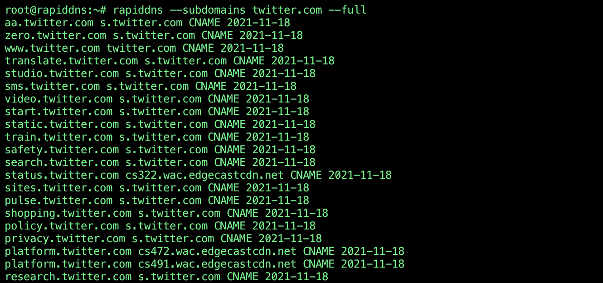

# Description
Simple python module (unofficial) allowing you to access data from rapiddns.io. You can also use it as a module.

As mentioned on the rapiddns.io:

*Rapiddns currently has more than 3 billion DNS resolution data, supporting A, CNAME, AAAA, MX types. A records 2.1 billion, CNAME records 250 million, AAAA records 103 million and MX records 510 million. Can query the domain name of the same IP website (support IPv6). You can also query subdomain information.*



# Installation
```
git clone https://github.com/nullt3r/rapiddns
cd rapiddns
pip3 install .
```

If you can't run the rapiddns directly from command line you should check if $HOME/.local/bin is in your path.

Add the following line to your `~/.zshrc` or `~/.bashrc`:

```
export PATH="$HOME/.local/bin:$PATH"
```

# Usage
To extract subdomains:
```
rapiddns --subdomains twitter.com
```
To extract domains from IP or CIDR:
```
rapiddns --ip 8.8.8.8/24
```
You can also combine both options.

To display full output, use option --full.

To use rapiddns as the module:

``` python
from rapiddns import RapidDns

enum_subdomains = RapidDns.subdomains("domain.com")
enum_domains = RapidDns.sameip("1.2.3.4/24")

for subdomain in enum_subdomains:
    print(" ".join(subdomain))

for domain in enum_domains:
    print(" ".join(domain))

```

# License
Read file LICENSE.

# Disclaimer
I am not responsible for any damages. You are responsible for your own
actions. Attacking targets without prior mutual consent is illegal.*